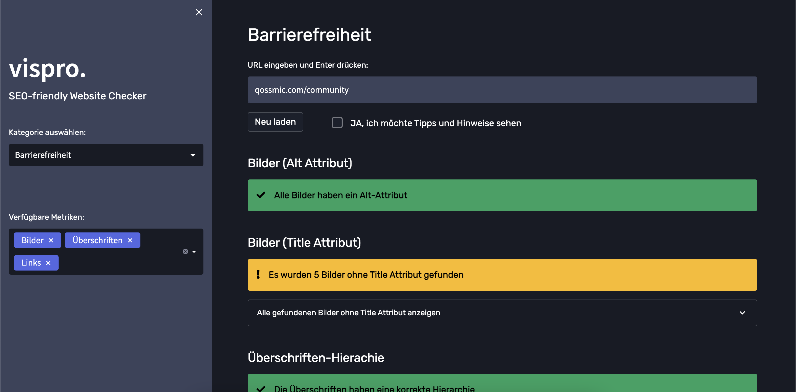

# vispro - SEO-friendly Website Checker

Hey Kollege, kennst du schon vispro? Das ist das neuste SEO-Tool auf dem Markt, das dir hilft, deine Website zu analysieren und zu optimieren. Es werden nicht nur SEO-Metriken geprüft, sondern auch best practices aus der Frontend-Entwicklung berücksichtigt, um eine technisch tolle Webseite auf die Beine zu stellen.

Mit vispro kannst du einen grundlegenden technischen SEO-Audit durchführen und bekommst coole Empfehlungen, wie du deine Sichtbarkeit in Suchmaschinen verbessern kannst. Also, worauf wartest du noch? Hol dir jetzt vispro und werde der SEO-King!

## Screenshots

<table>
  <tr>
    <td align="center"></td>
    <td align="center"></td>
  </tr>
  <tr>
    <td align="center"></td>
    <td align="center"></td>
  </tr>
  <tr>
    <td align="center"></td>
    <td align="center"></td>
  </tr>
</table>

## Installation

**(1.) Bevor du dieses GitLab-Repository klonst, stelle sicher, dass Python (Version 3) bei dir auf dem Computer installiert ist:**

Du hast schon Python? Dann prüfe, ob du die Python3 Version installiert hast:

```
python --version
```

Geprüft, aber kein Python3 oder vielleicht auch gar kein Python installiert?

Kein Problem! Du kannst Python3 [hier](https://www.python.org/downloads/) installieren.

**(2.) Jetzt klonst du das GitLab-Repository:**

```
git clone git@github.com:mad-daniel/vispro_seo_tool.git
```

**(3.) Fast geschafft. Jetzt noch die Python Pakete installieren:**

```
pip install -r requirements.txt
```

## Alternativ: Installation mit Docker

Wenn du python nicht lokal installieren willst, dann kannst du auch docker compose benutzen:

```
docker compose up
```

## App starten

Wenn du die oberen Schritte befolgt hast, dann hast du jetzt alle Dateien und Pakete, die du brauchst.

**Starte die App mit folgendem Befehl:**

```
streamlit run app.py
```

Jetzt warte einen kleinen Augenblick.

Die App öffnet sich automatisch und ist unter [localhost:8501](http://localhost:8501) erreichbar.

Happy coding ❤️

---

MIT License

Copyright (c) 2023 Daniel Kosbab

Permission is hereby granted, free of charge, to any person obtaining a copy
of this software and associated documentation files (the "Software"), to deal
in the Software without restriction, including without limitation the rights
to use, copy, modify, merge, publish, distribute, sublicense, and/or sell
copies of the Software, and to permit persons to whom the Software is
furnished to do so, subject to the following conditions:

The above copyright notice and this permission notice shall be included in
all copies or substantial portions of the Software.

THE SOFTWARE IS PROVIDED "AS IS", WITHOUT WARRANTY OF ANY KIND, EXPRESS OR
IMPLIED, INCLUDING BUT NOT LIMITED TO THE WARRANTIES OF MERCHANTABILITY,
FITNESS FOR A PARTICULAR PURPOSE AND NONINFRINGEMENT. IN NO EVENT SHALL THE
AUTHORS OR COPYRIGHT HOLDERS BE LIABLE FOR ANY CLAIM, DAMAGES OR OTHER
LIABILITY, WHETHER IN AN ACTION OF CONTRACT, TORT OR OTHERWISE, ARISING FROM,
OUT OF OR IN CONNECTION WITH THE SOFTWARE OR THE USE OR OTHER DEALINGS IN
THE SOFTWARE.
